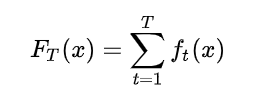
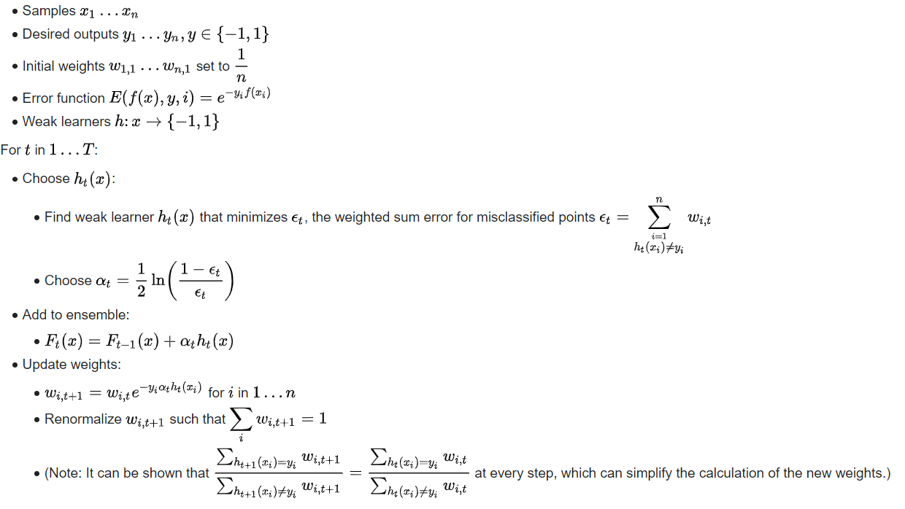
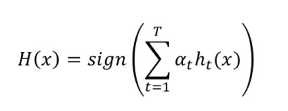
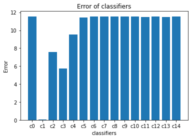

## AdaBoost :

Before talking about AdaBoost we need to explain what is Boosting ?

Boosting is an ensemble meta-algorithm in supervised learning, and a family of machine learning algorithms that convert **weak learners** to strong ones. Boosting is based on the question posed by **Kearns** and **Valiant**  [[2]](https://en.wikipedia.org/wiki/Boosting_(machine_learning)) .

**"Can a set of weak learners create a single strong learner?"**


The Boosting technique is described as follows :
<div align="center" >

</div>

Where ft is a weak classifier that takes a sample x as input and return the class of it , and T is the number of weak learners .

> **as you can see in the formula above , the Weak classifiers contribute in the result in the same amount , this is exacly the difference between a simple Boosting algorithm and AdaBosst , in AdaBoost the weak learners contribute with a value conrespending to their performance .**

The PseudoCode of AdaBoost is defined as following :

The Boosting technique is described as follows :
<div align="center" >

</div>


The Formula used to predict a certain sample is defined in the following :

<div align="center" >

</div>

> **As you can see in the formula above every Weak classifier contribute to the result with a value corresponding to his performance , This is The difference between a simple Boosting algorithm and AdaBoost.**

#### Implementation :

```python
import numpy as np
from sklearn.datasets import make_blobs
from sklearn.model_selection import train_test_split
import matplotlib.pyplot as plt

class DecisionStump:
    
    def __init__(self):
        self.classLabel = None
        self.threshold = None
        self.feature = None
        self.alpha = None
    
    def predict(self , x):
        Feature = x[:,self.feature]
        predictions = np.where(Feature < self.threshold , self.classLabel ,-1 * self.classLabel)
        return predictions

class AdaBoost:
    
    def __init__(self , nbr_classifiers = 10 , epsilon = 1e-10):
        self.nbr_classifiers = nbr_classifiers
        self.epsilon = epsilon
        self.classifiers = []
        
    def fit(self , x , y):
        self.x_train = x
        self.y_train = y
        #Initialize The weights for all the samples with 1 / nbr_samples
        self.weights = np.full(self.x_train.shape[0] , (1 / self.x_train.shape[0]) , dtype=np.float64)
    
    def train(self ):
        for i in range(self.nbr_classifiers):
            Weak_Classifier_i = DecisionStump()
            minimum_Error = float("inf")
            
            #Iterate Over all the features to find the perfect one that will split our data
            for feature in range(self.x_train.shape[1]):
                current_Feature = self.x_train[:,feature]
                #find thresholds Values which is the unique values of the feature that we're working with
                thresholds = np.unique(current_Feature)
                #iterate over all the thresholds to find the perfect one that will split the current feature
                for threshold in thresholds:
                    """
                    we don't know what the class of samples where feature < threshold , this is way we will test with class 1 ,
                    if the error more than 0.5 which is mean the majority of the samples that we calssified as 1 are -1 , so what we will do in this case ?
                    we will flip the error and assign -1 to our class label .
                    
                    if error (label used is 1) = 0.8 
                    then error(label is -1) = 0.2 .
                    
                    """
                    class_Label = 1
                    predictions = np.where(current_Feature < threshold , class_Label , -1 * class_Label)
                    error = np.sum(self.weights[self.y_train != predictions])
                    #flip The Error and The classLabel
                    if error > 0.5 :
                        error = 1-error
                        class_Label = -1
                    #if we find a better error less than the previous (we initialize The Error with float("if") which is a very small number)     
                    if error < minimum_Error:
                        Weak_Classifier_i.classLabel = class_Label
                        Weak_Classifier_i.threshold = threshold
                        Weak_Classifier_i.feature = feature
                        minimum_Error = error                    
            #Calculate The Performance of the Current Weak Classifier            
            Weak_Classifier_i.alpha = 0.5 * np.log((1 - minimum_Error + self.epsilon) / (minimum_Error + self.epsilon))        
            
            #Update The Weights
            predictions = Weak_Classifier_i.predict(self.x_train)
            self.weights *= (np.exp( - Weak_Classifier_i.alpha * predictions * self.y_train)) / (np.sum(self.weights))
            #save our Weak Classifier
            self.classifiers.append(Weak_Classifier_i)
            
    def predict(self , x):
         classifiers_predictions = [classifier.alpha * classifier.predict(x) for classifier in self.classifiers]
         y_pred = np.sum(classifiers_predictions , axis = 0)
         return np.sign(y_pred)
     
    def plotTheModel(self):
        fig , ax = plt.subplots()
        Weak_Classifiers = []
        Errors = []
        for i in range(self.nbr_classifiers):
            Weak_Classifiers.append("c"+str(i))
            Errors.append(self.classifiers[i].alpha)
        ax.bar(Weak_Classifiers , Errors)
        ax.set_ylabel("Error")
        ax.set_xlabel("classifiers")
        ax.set_title("Error of classifiers")
        plt.show()
#Test AdaBoost 
```

#### Testing The Model :

```python
def Accuracy(y , y_hat):
    return np.sum(y != y_hat) / len(y)


x , y = make_blobs(n_samples=500 , n_features=10 , centers=2 , random_state=0)
x_train , x_test , y_train , y_test = train_test_split(x , y , test_size=0.25)

adaBoost  = AdaBoost()
adaBoost.fit(x_train, y_train)
adaBoost.train()
y_hat = adaBoost.predict(x_test)
print("AdaBoost Accuracy : ",Accuracy(y_test, y_hat))
adaBoost.plotTheModel()
```

#### The Performance of each Weak Classifier that we get is :

<div align="center" >

</div>