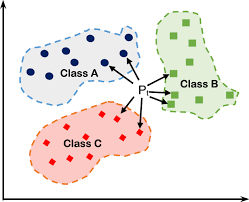

## k-nearest Neighbours :

The k-nearest neighbors is a simple supervised machine learning algorithm that can be used to solve both classification and regression problems , but in our case we're interested just in classification .


<div align="center" >

</div>

The idea behind K nearest neighbors is very simple , imagine with we have a training_set contains M samples , every sample contains N Features , if we've a new sample we want to classify , we need to find The K closest sample in the training_set to our new Sample (Using euclidean distance) , then the class of our sample is the most common class in The K closest samples that we calculated before , this is why they called it **K nearest neighbors** it all about finding the Neighbors .

#### Implementation :

```python
import matplotlib.pyplot as plt
from sklearn.datasets import make_blobs
from sklearn.model_selection import train_test_split
import numpy as np
from collections import Counter

class KNN:
    def __init__(self,k=5):
        self.k = k
    
    def fit(self,x,y):
        self.x_train = x
        self.y_train = y
        
    def euclidean_distance(self,x1,x2):
        return np.sqrt(np.sum((x2-x1)**2))
    
    def predict(self , x):
        y_hat = [self.predictOneSample(xi) for xi in x]
        return np.array(y_hat) # convert our list to numpy array        
    
    def predictOneSample(self,x):
        #calculate The Distance between our Point x and the rest .
        distances = [self.euclidean_distance(x, xt) for xt in self.x_train]
        
        #finding the indexes k smallest distances between our point x and the rest 
        """
              a = [20,0,1,3,10,70,9,8]
              indexOfMin = np.argsort(distances)[0]
              indexOfMax = np.argsort(distances)[-1]
              indexesOfTheSortedArray = np.argsort(distances)
        """
        k_neighbours = np.argsort(distances)[:self.k]
        #finding the labels of the closest points to x
        k_lables = [self.y_train[i] for i in k_neighbours]
        
        #finding The Most Common lables using Counter 
        """
             a = [10,10,20,10,20,30]
             print(Counter(a))
                 output = {10: 3, 20: 2, 30: 1}
             most_common = Counter(a).most_common(1)   
                 output = [(10, 3)]
             #To get The Most Common element in our list
             m_common_element = most_common[0][0]
        
        """
        common_lables = Counter(k_lables).most_common(1)
        return common_lables[0][0]     
    
    def getaccuracy(self,y,y_hat):
        return (np.sum(y == y_hat)  / len(y_hat))* 100

```

#### Testing The Model :


```python
x , y = make_blobs(n_samples=100 ,n_features=2 , centers=2 , random_state=0)

x_train , x_test , y_train , y_test = train_test_split(x,y,test_size=0.25)

KNN = KNN()
KNN.fit(x_train, y_train)
y_hat = KNN.predict(x_test)
print("Model Accuarcy : ", KNN.getaccuracy(y_test, y_hat) , " %")

```