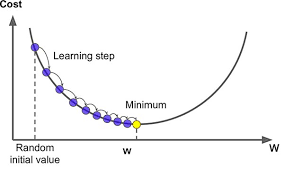
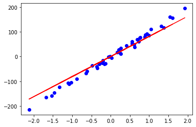

## Linear Regression :
Linear regression is a linear approach for modelling the relationship between X and Y , where X is The Input Data and Y is The Target .

<div align="center" >

</div>

So linear regression consists of finding the coefficients m and b so that Y = m * X + b.

The Question now how can we find those coefficients :
- we can try guess and check ??? (it not a good idea believe me) . 
- we can Use Gradient Descent to find them .

<div align="center" >

</div>

Gradient descent is a first-order iterative optimization algorithm for finding a local minimum of a differentiable function. The idea is to take repeated steps in the opposite direction of the gradient (or approximate gradient) of the function at the current point, because this is the direction of steepest descent. Conversely, stepping in the direction of the gradient will lead to a local maximum of that function; the procedure is then known as gradient ascent. [[1]](https://en.wikipedia.org/wiki/Gradient_descent)  

The Cost Function Used in this Example is **Log-Loss** and it defined as following :

<div align="center" >

</div>

The Optimization Algorithm Used in this Example is **Gradient Descent** ans it defined as following :

<div align="center" >

</div>

#### Implementation :
```python
import numpy as np
import matplotlib.pyplot as plt
from sklearn.datasets import make_regression
from sklearn.model_selection import train_test_split

class LinearRegression:
    
    def __init__(self , learning_rate = 0.01 , nbr_iterations = 100):
        self .learning_rate = learning_rate
        self.nbr_iterations = nbr_iterations
    
    def init_Parameters(self,x):
        w , b = np.random.randn(x.shape[1]) , np.random.randn(1)
        return w , b
    
    def fit(self,x,y):
        self.x_train = x
        self.y_train = y
        self.w , self.b = self.init_Parameters(self.x_train)
   
    def gradient(self,y_hat):
       dw = (1 / len(self.y_train)) * np.dot( -2 * self.x_train.T , (self.y_train - y_hat) )
       db = (1 / len(self.y_train)) * -2 * np.sum(self.y_train - y_hat)
       return dw , db
   
    def train(self):
        for i in range(self.nbr_iterations) :
            y_hat = np.dot(self.x_train,self.w ) + self.b
            dw , db = self.gradient(y_hat)
            
            #Update The Weight and The Bias
            self.w -= self.learning_rate * dw
            self.b -= self.learning_rate * db
    def predict(self , x):
        y_hat = np.dot(x , self.w ) + self.b 
        return y_hat
    
    def displayTheModel(self,x_test,y_test,y_hat):
        plt.scatter(x_test , y_test , color='b')
        plt.plot(x_test , y_hat , color='r')
        plt.show()
```
#### Testing The Model :

```python
def MSE(y_true , y_pred):
    return 1 / len(y_true) * np.sum((y_true - y_hat) ** 2)


x , y = make_regression(n_samples=200 , n_features=1 , noise=0)
x_train , x_test , y_train , y_test = train_test_split(x,y , test_size=0.25)
        
L_Regression = LinearRegression()
L_Regression.fit(x_train, y_train)
L_Regression.train()
y_hat = L_Regression.predict(x_test)
L_Regression.displayTheModel(x_test, y_test, y_hat)            


print("MSE : ",MSE(y_test , y_hat))

```

#### The Model Result :
<div align="center" >

</div>