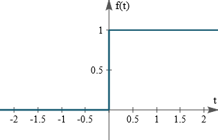
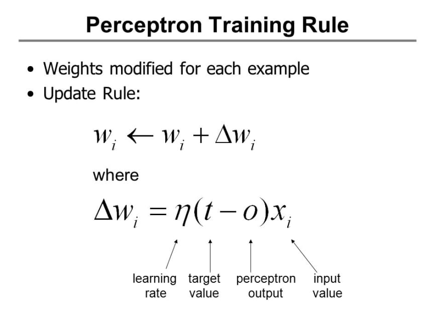

## Perceptron :
the perceptron is an algorithm for supervised learning of binary classifiers. A binary classifier is a function which can decide whether or not an input, represented by a vector of numbers, belongs to some specific class.[[1]](https://en.wikipedia.org/wiki/Perceptron)

<div align="center" >

</div>

>The Activation Function Used by The Perceptron is **Step Function** it called also **Heaviside Function**.

Formula of step function : 
<div align="center" >

</div>

graph of step function :
<div align="center" >

</div>

The Update Rules for The Perceptron are :
<div align="center" >

</div>

#### Implementation :

```python
import numpy as np
import matplotlib.pyplot as plt
from sklearn.datasets import make_blobs
from sklearn.model_selection import train_test_split
from sklearn.metrics import accuracy_score

class Perceptron : 
    
    def __init__(self,learning_rate = 0.1 , number_iter = 1000):
        self.learning_rate = learning_rate
        self.number_iter   = number_iter
        
    
    def fit(self,x,y):
        self.x = x
        self.y = y
    
    
    def initParameters(self , x):
        w = np.random.randn(1,x.shape[1])         
        return w
    
    def heaviside(self,x):
        return 1 if x>= 0 else 0
    
    def heavisideArray(self,x):
        a = [1 if x1>= 0 else 0 for x1 in x[0]]
        return a
    
    def train(self):
        self.w = self.initParameters(self.x)
        
        for i in range(self.number_iter):
            for x , y in zip(self.x , self.y):
                z = np.dot(self.w , x)
                y_hat = self.heaviside(z)
                self.w += self.learning_rate * (y - y_hat) * x                
                
    def predict(self,x):
        z = np.dot(self.w , x)
        a = self.heavisideArray(z)
        return a
    
    def displayModel(self):
        fig , ax = plt.subplots(figsize=(10,7))
        ax.scatter(self.x[:,0] , self.x[:,1] , c = self.y , cmap="bwr")
        x1 = np.linspace(-15,4,100)
        x2 = (-self.w[0][0] * x1 - self.w[0][2]) / self.w[0][1]
        ax.plot(x1,x2 , c='g' , lw=8)

```

#### Test The Model :

```python
x , y = make_blobs(n_samples=200 , n_features=2 , centers=2 , random_state= 0)

x_train , x_test , y_train , y_test = train_test_split(x,y,test_size=0.5 , random_state=0)

b = np.ones(x_train.shape[0])
b = b.reshape(b.shape[0] , 1)
x_train = np.hstack((x_train , b))

b = np.ones(x_test.shape[0])
b = b.reshape(b.shape[0] , 1)
x_test  = np.hstack((x_test , b))

perceptron = Perceptron()
perceptron.fit(x_train, y_train)
perceptron.train()
perceptron.displayModel()
y_hat = perceptron.predict(x_test.T)
score = accuracy_score(y_test , y_hat)
print("Model Accuracy : ", score)

```

#### The Model Result :

<div align="center" >

</div>

The Result is not Perfect because this is what we get when we use a linear Model , as you can se the figure above we can't separate the data with a line .