# Most Common Algorithms of Machine Learning
This Repository contains The Implementation of this Algorithms :

* Linear Regression .
* Logistic Regression .
* Perceptron .
* k-nearest Neighbours .
* Support Vector Machine .
* K-Means .
* Naive Bayes .
* Decision Tree .
* Random Forest .
* AdaBoost .

---
## Linear Regression :
Linear regression is a linear approach for modelling the relationship between X and Y , where X is The Input Data and Y is The Target .

<div align="center" >
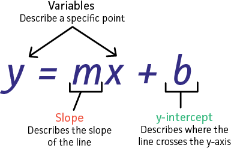
</div>

So linear regression consists of finding the coefficients m and b so that Y = m * X + b.

The Question now how can we find those coefficients :
- we can try guess and check ??? (it not a good idea believe me) . 
- we can Use Gradient Descent to find them .

<div align="center" >
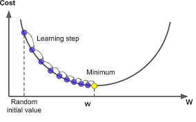
</div>

Gradient descent is a first-order iterative optimization algorithm for finding a local minimum of a differentiable function. The idea is to take repeated steps in the opposite direction of the gradient (or approximate gradient) of the function at the current point, because this is the direction of steepest descent. Conversely, stepping in the direction of the gradient will lead to a local maximum of that function; the procedure is then known as gradient ascent. [[1]](https://en.wikipedia.org/wiki/Gradient_descent)  

The Cost Function Used in this Example is **Log-Loss** and it defined as following :

<div align="center" >
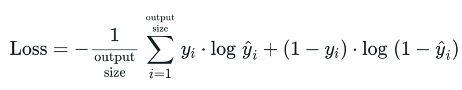
</div>

The Optimization Algorithm Used in this Example is **Gradient Descent** ans it defined as following :

<div align="center" >
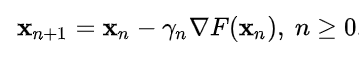
</div>

### Implementation :
```python
import numpy as np
import matplotlib.pyplot as plt
from sklearn.datasets import make_regression
from sklearn.model_selection import train_test_split

class LinearRegression:
    
    def __init__(self , learning_rate = 0.01 , nbr_iterations = 100):
        self .learning_rate = learning_rate
        self.nbr_iterations = nbr_iterations
    
    def init_Parameters(self,x):
        w , b = np.random.randn(x.shape[1]) , np.random.randn(1)
        return w , b
    
    def fit(self,x,y):
        self.x_train = x
        self.y_train = y
        self.w , self.b = self.init_Parameters(self.x_train)
   
    def gradient(self,y_hat):
       dw = (1 / len(self.y_train)) * np.dot( -2 * self.x_train.T , (self.y_train - y_hat) )
       db = (1 / len(self.y_train)) * -2 * np.sum(self.y_train - y_hat)
       return dw , db
   
    def train(self):
        for i in range(self.nbr_iterations) :
            y_hat = np.dot(self.x_train,self.w ) + self.b
            dw , db = self.gradient(y_hat)
            
            #Update The Weight and The Bias
            self.w -= self.learning_rate * dw
            self.b -= self.learning_rate * db
    def predict(self , x):
        y_hat = np.dot(x , self.w ) + self.b 
        return y_hat
    
    def displayTheModel(self,x_test,y_test,y_hat):
        plt.scatter(x_test , y_test , color='b')
        plt.plot(x_test , y_hat , color='r')
        plt.show()
```
### Testing The Model :

```python
def MSE(y_true , y_pred):
    return 1 / len(y_true) * np.sum((y_true - y_hat) ** 2)


x , y = make_regression(n_samples=200 , n_features=1 , noise=0)
x_train , x_test , y_train , y_test = train_test_split(x,y , test_size=0.25)
        
L_Regression = LinearRegression()
L_Regression.fit(x_train, y_train)
L_Regression.train()
y_hat = L_Regression.predict(x_test)
L_Regression.displayTheModel(x_test, y_test, y_hat)            


print("MSE : ",MSE(y_test , y_hat))

```

### The Model Result :
<div align="center" >
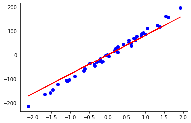
</div>

---
## Logistic Regression :
Logistic regression is a Binary Classification Algorithm , The Idea is very Simple we train The Model with a list of couples (x_i , y_i) to figure out The best Coefficient m and b that will fit our data .

<div align="center" >

</div>

Then we apply an Activation Function called **logistic Function** or **Sigmoid**.

<div align="center" >

</div>

what we're trying to do is we try to find A line ( Y = m*X + b ) that will split our data to two classes , class 0 where activation(Predicted value) > 0.5 , class 1 where activation(Predicted value) < 0.5 .

The Cost Function Used in this Example is **Log-Loss** and it defined as following :

<div align="center" >

</div>

The Optimization Algorithm Used in this Example is **Gradient Descent** ans it defined as following :

<div align="center" >

</div>


### Implementation :

``` python

import numpy as np
import matplotlib.pyplot as plt
from sklearn.datasets import make_blobs
from sklearn.model_selection import train_test_split
from sklearn.metrics import accuracy_score

class LogisticRegression :
    
    def __init__(self , learning_rate = 0.01 , nbr_iter = 1000):
        self.learning_rate = learning_rate
        self.nbr_iter = nbr_iter
        self.losses = []
    
    def initParameters(self , x):
        w = np.random.randn(x.shape[1])
        b = np.random.randn(1)
        return w , b
    def sigmoid(self,x):
        return 1 / (1 + np.exp(-x))
    
    def MSE(self , y_true , y_hat):
        return 1 / len(y_true) * np.sum((y_true - y_hat) ** 2)
    
    def fit(self , x , y):
        self.x_train = x
        self.y_train = y
        self.w , self.b = self.initParameters(self.x_train)
   
    def gradient(self,y_hat):
       dw = 1 / len(self.y_train) * -2 * np.dot(self.x_train.T , self.y_train - y_hat)
       db = 1 / len(self.y_train) * -2 * np.sum(self.y_train - y_hat)
       return dw , db
   
    def train(self):
        for i in range(self.nbr_iter) :
            z = np.dot(self.x_train , self.w) + self.b
            y_hat = self.sigmoid(z)
            loss = self.MSE(self.y_train , y_hat)
            self.losses.append(loss)
            dw , db = self.gradient(y_hat)
            
            self.w -= self.learning_rate * dw
            self.b -= self.learning_rate * db
    
    def predict(self , x):
        z = np.dot(x , self.w) + self.b 
        y_hat = self.sigmoid(z)
        y_hat = [1 if yi >= 0.5 else 0 for yi in y_hat]
        return np.array(y_hat)
    
    def didplayTheModel(self , x , y):
        x1 = np.linspace(0 , 100 , self.nbr_iter)
        plt.plot(x1 , self.losses)
        plt.title("Loss")
        plt.show()
        
        fig , ax = plt.subplots()
        x0_lim = ax.get_xlim()
        
        ax.scatter(x[:,0] , x[:,1] , c = y , cmap="bwr")
        x1 = np.linspace(-8,x0_lim[1],200)
        x2 = (-x1 * self.w[0]   - self.b) / self.w[1]
        plt.plot(x1  , x2 , c='g')
        plt.show()
```
### Test The Model :

```python
x , y = make_blobs(n_samples=200 , n_features=2 , centers= 2 , random_state=1234)
x_train , x_test , y_train , y_test = train_test_split(x , y , test_size=0.25)

L_regression = LogisticRegression()
L_regression.fit(x_train, y_train)
L_regression.train()
y_hat = L_regression.predict(x_test)
score = accuracy_score(y_test , y_hat)
L_regression.didplayTheModel(x, y)
```

### The Model Result :

<div align="center" >
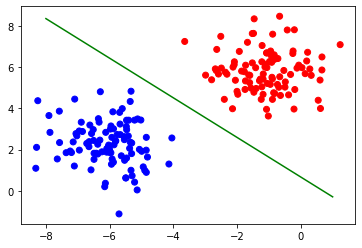
</div>

### The Loss of The Model :


<div align="center" >

</div>

In this example we used 100 iteration to train The Model , and as you can see The Loss is decreasing Over iterations .

---
## Perceptron :
the perceptron is an algorithm for supervised learning of binary classifiers. A binary classifier is a function which can decide whether or not an input, represented by a vector of numbers, belongs to some specific class.[[1]](https://en.wikipedia.org/wiki/Perceptron)

<div align="center" >
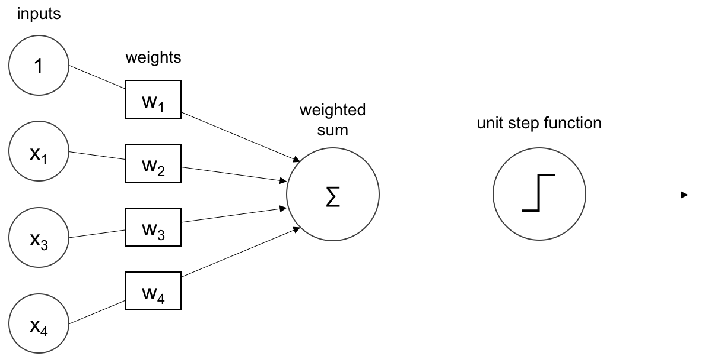
</div>

>The Activation Function Used by The Perceptron is **Step Function** it called also **Heaviside Function**.

Formula of step function : 
<div align="center" >
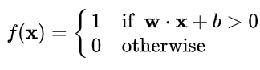
</div>

graph of step function :
<div align="center" >
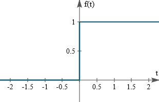
</div>

The Update Rules for The Perceptron are :
<div align="center" >
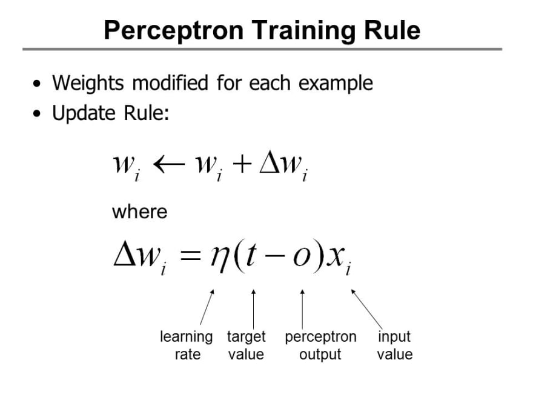
</div>

### Implementation :

```python
import numpy as np
import matplotlib.pyplot as plt
from sklearn.datasets import make_blobs
from sklearn.model_selection import train_test_split
from sklearn.metrics import accuracy_score

class Perceptron : 
    
    def __init__(self,learning_rate = 0.1 , number_iter = 1000):
        self.learning_rate = learning_rate
        self.number_iter   = number_iter
        
    
    def fit(self,x,y):
        self.x = x
        self.y = y
    
    
    def initParameters(self , x):
        w = np.random.randn(1,x.shape[1])         
        return w
    
    def heaviside(self,x):
        return 1 if x>= 0 else 0
    
    def heavisideArray(self,x):
        a = [1 if x1>= 0 else 0 for x1 in x[0]]
        return a
    
    def train(self):
        self.w = self.initParameters(self.x)
        
        for i in range(self.number_iter):
            for x , y in zip(self.x , self.y):
                z = np.dot(self.w , x)
                y_hat = self.heaviside(z)
                self.w += self.learning_rate * (y - y_hat) * x                
                
    def predict(self,x):
        z = np.dot(self.w , x)
        a = self.heavisideArray(z)
        return a
    
    def displayModel(self):
        fig , ax = plt.subplots(figsize=(10,7))
        ax.scatter(self.x[:,0] , self.x[:,1] , c = self.y , cmap="bwr")
        x1 = np.linspace(-15,4,100)
        x2 = (-self.w[0][0] * x1 - self.w[0][2]) / self.w[0][1]
        ax.plot(x1,x2 , c='g' , lw=8)

```

### Test The Model :

```python
x , y = make_blobs(n_samples=200 , n_features=2 , centers=2 , random_state= 0)

x_train , x_test , y_train , y_test = train_test_split(x,y,test_size=0.5 , random_state=0)

b = np.ones(x_train.shape[0])
b = b.reshape(b.shape[0] , 1)
x_train = np.hstack((x_train , b))

b = np.ones(x_test.shape[0])
b = b.reshape(b.shape[0] , 1)
x_test  = np.hstack((x_test , b))

perceptron = Perceptron()
perceptron.fit(x_train, y_train)
perceptron.train()
perceptron.displayModel()
y_hat = perceptron.predict(x_test.T)
score = accuracy_score(y_test , y_hat)
print("Model Accuracy : ", score)

```

### The Model Result :

<div align="center" >
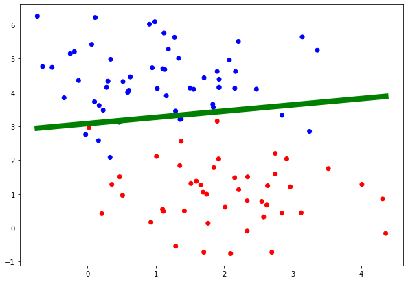
</div>

The Result is not Perfect because this is what we get when we use a linear Model , as you can se the figure above we can't separate the data with a line .

---
## k-nearest Neighbours :

The k-nearest neighbors is a simple supervised machine learning algorithm that can be used to solve both classification and regression problems , but in our case we're interested just in classification .


<div align="center" >
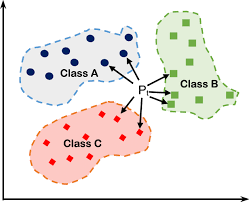
</div>

The idea behind K nearest neighbors is very simple , imagine with we have a training_set contains M samples , every sample contains N Features , if we've a new sample we want to classify , we need to find The K closest sample in the training_set to our new Sample (Using euclidean distance) , then the class of our sample is the most common class in The K closest samples that we calculated before , this is why they called it **K nearest neighbors** it all about finding the Neighbors .

### Implementation :

```python
import matplotlib.pyplot as plt
from sklearn.datasets import make_blobs
from sklearn.model_selection import train_test_split
import numpy as np
from collections import Counter

class KNN:
    def __init__(self,k=5):
        self.k = k
    
    def fit(self,x,y):
        self.x_train = x
        self.y_train = y
        
    def euclidean_distance(self,x1,x2):
        return np.sqrt(np.sum((x2-x1)**2))
    
    def predict(self , x):
        y_hat = [self.predictOneSample(xi) for xi in x]
        return np.array(y_hat) # convert our list to numpy array        
    
    def predictOneSample(self,x):
        #calculate The Distance between our Point x and the rest .
        distances = [self.euclidean_distance(x, xt) for xt in self.x_train]
        
        #finding the indexes k smallest distances between our point x and the rest 
        """
              a = [20,0,1,3,10,70,9,8]
              indexOfMin = np.argsort(distances)[0]
              indexOfMax = np.argsort(distances)[-1]
              indexesOfTheSortedArray = np.argsort(distances)
        """
        k_neighbours = np.argsort(distances)[:self.k]
        #finding the labels of the closest points to x
        k_lables = [self.y_train[i] for i in k_neighbours]
        
        #finding The Most Common lables using Counter 
        """
             a = [10,10,20,10,20,30]
             print(Counter(a))
                 output = {10: 3, 20: 2, 30: 1}
             most_common = Counter(a).most_common(1)   
                 output = [(10, 3)]
             #To get The Most Common element in our list
             m_common_element = most_common[0][0]
        
        """
        common_lables = Counter(k_lables).most_common(1)
        return common_lables[0][0]     
    
    def getaccuracy(self,y,y_hat):
        return (np.sum(y == y_hat)  / len(y_hat))* 100

```

### Testing The Model :


```python
x , y = make_blobs(n_samples=100 ,n_features=2 , centers=2 , random_state=0)

x_train , x_test , y_train , y_test = train_test_split(x,y,test_size=0.25)

KNN = KNN()
KNN.fit(x_train, y_train)
y_hat = KNN.predict(x_test)
print("Model Accuarcy : ", KNN.getaccuracy(y_test, y_hat) , " %")

```
---

## Support Vector Machine (SVM) :

Support Vector Machine or SVM is a supervised learning Algorithm used for classification and regression problems. 
SVM can solve linear and non-linear problems , The idea behind SVM is very simple , the algorithm try to create a line that can separate the classes .

<div align="center" >

</div>

The goal of the line is to maximizing the margin between the points on either side of the so called decision line.

The Cost Function Used is This Example is defined  as bellow :

<div align="center" >
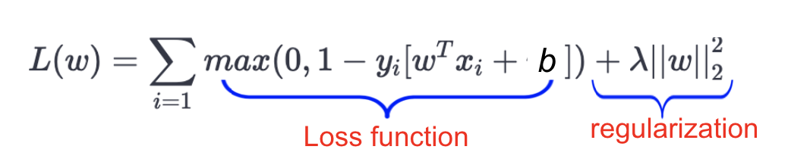
</div>

### Implementation :

```python 

import numpy as np
import matplotlib.pyplot as plt
from sklearn.datasets import make_blobs
from sklearn.model_selection import train_test_split

class SVM :
    
    def __init__(self , learning_rate = 0.01 , lambda_parameter = 0.01 , nbr_iteration = 1000):
        self.learning_rate = learning_rate
        self.lambda_parameter = lambda_parameter
        self.nbr_iteration = nbr_iteration
    
    def fit(self , x , y):
        self.x_train = x
        self.y_train = y #np.where(y<=0 , -1 , 1)
        self.w , self.b = self.initParameters(x)
   
    def initParameters(self , x):
       w = np.random.randn(x.shape[1])
       b = np.random.randn(1)
       return w , b
   
    def gradient(self,xi,yi,condition):
        if condition :
            dw = 2 * self.lambda_parameter * self.w
            db = 0
            return dw , db
        else :
            dw = 2 * self.lambda_parameter * self.w - np.dot(xi , yi)
            db = yi
            return dw , db
    def train(self):
        for i in range(self.nbr_iteration):
            for index , xi in enumerate(self.x_train):
                condition = self.y_train[index] * (np.dot(xi , self.w) - self.b ) >= 1
                dw , db = self.gradient(xi, self.y_train[index], condition)
                #Update The Weights and The Bias
                self.w -= self.learning_rate * dw
                self.b -= self.learning_rate * db
    
    def predict(self , x):
        y_hat = np.dot(x , self.w) - self.b
        return np.sign(y_hat)

    def displayTheModel(self,x,y):
        fig , ax = plt.subplots()
        ax.scatter(x[:,0][y==1] , x[:,1][y==1] , marker='o')
        ax.scatter(x[:,0][y==-1] , x[:,1][y==-1] , marker='+')
        
        x0_min = np.amin(x[:,0])
        x0_max = np.amax(x[:,0])
        
        x1_x_for_separator = (-self.w[0] * x0_min + self.b + 0 ) / self.w[1]
        x1_y_for_separator = (-self.w[0] * x0_max + self.b + 0 ) / self.w[1]

        x1_x_for_class1 = (-self.w[0] * x0_min + self.b -1 ) / self.w[1]
        x1_y_for_class1 = (-self.w[0] * x0_max + self.b -1 ) / self.w[1]

        x1_x_for_class2 = (-self.w[0] * x0_min + self.b + 1 ) / self.w[1]
        x1_y_for_class2 = (-self.w[0] * x0_max + self.b + 1 ) / self.w[1]
        
        ax.plot([x0_min , x0_max] , [x1_x_for_separator , x1_y_for_separator] , "red")
        ax.plot([x0_min , x0_max] , [x1_x_for_class1 , x1_y_for_class1] , "black")
        ax.plot([x0_min , x0_max] , [x1_x_for_class2 , x1_y_for_class2] , "black")
        
        x1_min = np.amin(x[:, 1])
        x1_max = np.amax(x[:, 1])
        ax.set_ylim([x1_min - 3, x1_max + 3])
        
        plt.show()
        
    def getAccuarcy(self , y_true , y_pred):
       return np.sum(y_true == y_pred) / len(y_true)

```

### Testing The Model :

```python
x , y = make_blobs(n_samples=100 , n_features=2 , centers=2 , random_state=0)
y = np.where(y==0 , -1 , 1)
x_train , x_test , y_train , y_test = train_test_split(x , y , test_size=0.25)   
    
svm = SVM()
svm.fit(x_train, y_train)
svm.train()
y_hat = svm.predict(x_test)
print("Model Accuracy : ",svm.getAccuarcy(y_test, y_hat))
svm.displayTheModel(x, y)

```

### The Model Result :

<div align="center" >
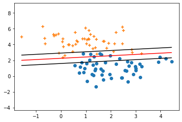
</div>

---
## K-Means :


