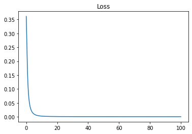
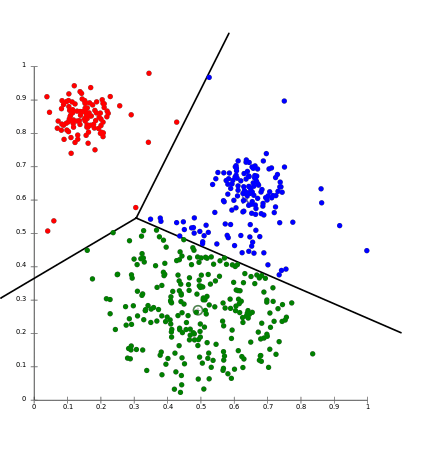
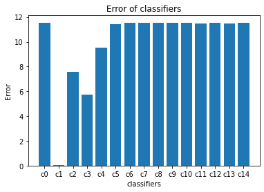

# Most Common Machine Learning Algorithms 
This Repository contains The Explanation and the Implementation of this Algorithms :

* Linear Regression .
* Logistic Regression .
* Perceptron .
* k-nearest Neighbours .
* Support Vector Machine .
* K-Means .
* Naive Bayes .
* Decision Tree .
* Random Forest .
* AdaBoost .

---
## Linear Regression :
Linear regression is a linear approach for modelling the relationship between X and Y , where X is The Input Data and Y is The Target .

<div align="center" >

</div>

So linear regression consists of finding the coefficients m and b so that Y = m * X + b.

The Question now how can we find those coefficients :
- we can try guess and check ??? (it not a good idea believe me) . 
- we can Use Gradient Descent to find them .

<div align="center" >

</div>

Gradient descent is a first-order iterative optimization algorithm for finding a local minimum of a differentiable function. The idea is to take repeated steps in the opposite direction of the gradient (or approximate gradient) of the function at the current point, because this is the direction of steepest descent. Conversely, stepping in the direction of the gradient will lead to a local maximum of that function; the procedure is then known as gradient ascent. [[1]](https://en.wikipedia.org/wiki/Gradient_descent)  

The Cost Function Used in this Example is **Log-Loss** and it defined as following :

<div align="center" >

</div>

The Optimization Algorithm Used in this Example is **Gradient Descent** ans it defined as following :

<div align="center" >

</div>

#### Implementation :
```python
import numpy as np
import matplotlib.pyplot as plt
from sklearn.datasets import make_regression
from sklearn.model_selection import train_test_split

class LinearRegression:
    
    def __init__(self , learning_rate = 0.01 , nbr_iterations = 100):
        self .learning_rate = learning_rate
        self.nbr_iterations = nbr_iterations
    
    def init_Parameters(self,x):
        w , b = np.random.randn(x.shape[1]) , np.random.randn(1)
        return w , b
    
    def fit(self,x,y):
        self.x_train = x
        self.y_train = y
        self.w , self.b = self.init_Parameters(self.x_train)
   
    def gradient(self,y_hat):
       dw = (1 / len(self.y_train)) * np.dot( -2 * self.x_train.T , (self.y_train - y_hat) )
       db = (1 / len(self.y_train)) * -2 * np.sum(self.y_train - y_hat)
       return dw , db
   
    def train(self):
        for i in range(self.nbr_iterations) :
            y_hat = np.dot(self.x_train,self.w ) + self.b
            dw , db = self.gradient(y_hat)
            
            #Update The Weight and The Bias
            self.w -= self.learning_rate * dw
            self.b -= self.learning_rate * db
    def predict(self , x):
        y_hat = np.dot(x , self.w ) + self.b 
        return y_hat
    
    def displayTheModel(self,x_test,y_test,y_hat):
        plt.scatter(x_test , y_test , color='b')
        plt.plot(x_test , y_hat , color='r')
        plt.show()
```
#### Testing The Model :

```python
def MSE(y_true , y_pred):
    return 1 / len(y_true) * np.sum((y_true - y_hat) ** 2)


x , y = make_regression(n_samples=200 , n_features=1 , noise=0)
x_train , x_test , y_train , y_test = train_test_split(x,y , test_size=0.25)
        
L_Regression = LinearRegression()
L_Regression.fit(x_train, y_train)
L_Regression.train()
y_hat = L_Regression.predict(x_test)
L_Regression.displayTheModel(x_test, y_test, y_hat)            


print("MSE : ",MSE(y_test , y_hat))

```

#### The Model Result :
<div align="center" >

</div>

---
## Logistic Regression :
Logistic regression is a Binary Classification Algorithm , The Idea is very Simple we train The Model with a list of couples (x_i , y_i) to figure out The best Coefficient m and b that will fit our data .

<div align="center" >

</div>

Then we apply an Activation Function called **logistic Function** or **Sigmoid**.

<div align="center" >

</div>

what we're trying to do is we try to find A line ( Y = m*X + b ) that will split our data to two classes , class 0 where activation(Predicted value) > 0.5 , class 1 where activation(Predicted value) < 0.5 .

The Cost Function Used in this Example is **Log-Loss** and it defined as following :

<div align="center" >

</div>

The Optimization Algorithm Used in this Example is **Gradient Descent** ans it defined as following :

<div align="center" >

</div>


#### Implementation :

``` python

import numpy as np
import matplotlib.pyplot as plt
from sklearn.datasets import make_blobs
from sklearn.model_selection import train_test_split
from sklearn.metrics import accuracy_score

class LogisticRegression :
    
    def __init__(self , learning_rate = 0.01 , nbr_iter = 1000):
        self.learning_rate = learning_rate
        self.nbr_iter = nbr_iter
        self.losses = []
    
    def initParameters(self , x):
        w = np.random.randn(x.shape[1])
        b = np.random.randn(1)
        return w , b
    def sigmoid(self,x):
        return 1 / (1 + np.exp(-x))
    
    def MSE(self , y_true , y_hat):
        return 1 / len(y_true) * np.sum((y_true - y_hat) ** 2)
    
    def fit(self , x , y):
        self.x_train = x
        self.y_train = y
        self.w , self.b = self.initParameters(self.x_train)
   
    def gradient(self,y_hat):
       dw = 1 / len(self.y_train) * -2 * np.dot(self.x_train.T , self.y_train - y_hat)
       db = 1 / len(self.y_train) * -2 * np.sum(self.y_train - y_hat)
       return dw , db
   
    def train(self):
        for i in range(self.nbr_iter) :
            z = np.dot(self.x_train , self.w) + self.b
            y_hat = self.sigmoid(z)
            loss = self.MSE(self.y_train , y_hat)
            self.losses.append(loss)
            dw , db = self.gradient(y_hat)
            
            self.w -= self.learning_rate * dw
            self.b -= self.learning_rate * db
    
    def predict(self , x):
        z = np.dot(x , self.w) + self.b 
        y_hat = self.sigmoid(z)
        y_hat = [1 if yi >= 0.5 else 0 for yi in y_hat]
        return np.array(y_hat)
    
    def didplayTheModel(self , x , y):
        x1 = np.linspace(0 , 100 , self.nbr_iter)
        plt.plot(x1 , self.losses)
        plt.title("Loss")
        plt.show()
        
        fig , ax = plt.subplots()
        x0_lim = ax.get_xlim()
        
        ax.scatter(x[:,0] , x[:,1] , c = y , cmap="bwr")
        x1 = np.linspace(-8,x0_lim[1],200)
        x2 = (-x1 * self.w[0]   - self.b) / self.w[1]
        plt.plot(x1  , x2 , c='g')
        plt.show()
```
#### Test The Model :

```python
x , y = make_blobs(n_samples=200 , n_features=2 , centers= 2 , random_state=1234)
x_train , x_test , y_train , y_test = train_test_split(x , y , test_size=0.25)

L_regression = LogisticRegression()
L_regression.fit(x_train, y_train)
L_regression.train()
y_hat = L_regression.predict(x_test)
score = accuracy_score(y_test , y_hat)
L_regression.didplayTheModel(x, y)
```

#### The Model Result :

<div align="center" >

</div>

#### The Loss of The Model :


<div align="center" >

</div>

In this example we used 100 iteration to train The Model , and as you can see The Loss is decreasing Over iterations .

---
## Perceptron :
the perceptron is an algorithm for supervised learning of binary classifiers. A binary classifier is a function which can decide whether or not an input, represented by a vector of numbers, belongs to some specific class.[[1]](https://en.wikipedia.org/wiki/Perceptron)

<div align="center" >

</div>

>The Activation Function Used by The Perceptron is **Step Function** it called also **Heaviside Function**.

Formula of step function : 
<div align="center" >

</div>

graph of step function :
<div align="center" >

</div>

The Update Rules for The Perceptron are :
<div align="center" >

</div>

#### Implementation :

```python
import numpy as np
import matplotlib.pyplot as plt
from sklearn.datasets import make_blobs
from sklearn.model_selection import train_test_split
from sklearn.metrics import accuracy_score

class Perceptron : 
    
    def __init__(self,learning_rate = 0.1 , number_iter = 1000):
        self.learning_rate = learning_rate
        self.number_iter   = number_iter
        
    
    def fit(self,x,y):
        self.x = x
        self.y = y
    
    
    def initParameters(self , x):
        w = np.random.randn(1,x.shape[1])         
        return w
    
    def heaviside(self,x):
        return 1 if x>= 0 else 0
    
    def heavisideArray(self,x):
        a = [1 if x1>= 0 else 0 for x1 in x[0]]
        return a
    
    def train(self):
        self.w = self.initParameters(self.x)
        
        for i in range(self.number_iter):
            for x , y in zip(self.x , self.y):
                z = np.dot(self.w , x)
                y_hat = self.heaviside(z)
                self.w += self.learning_rate * (y - y_hat) * x                
                
    def predict(self,x):
        z = np.dot(self.w , x)
        a = self.heavisideArray(z)
        return a
    
    def displayModel(self):
        fig , ax = plt.subplots(figsize=(10,7))
        ax.scatter(self.x[:,0] , self.x[:,1] , c = self.y , cmap="bwr")
        x1 = np.linspace(-15,4,100)
        x2 = (-self.w[0][0] * x1 - self.w[0][2]) / self.w[0][1]
        ax.plot(x1,x2 , c='g' , lw=8)

```

#### Test The Model :

```python
x , y = make_blobs(n_samples=200 , n_features=2 , centers=2 , random_state= 0)

x_train , x_test , y_train , y_test = train_test_split(x,y,test_size=0.5 , random_state=0)

b = np.ones(x_train.shape[0])
b = b.reshape(b.shape[0] , 1)
x_train = np.hstack((x_train , b))

b = np.ones(x_test.shape[0])
b = b.reshape(b.shape[0] , 1)
x_test  = np.hstack((x_test , b))

perceptron = Perceptron()
perceptron.fit(x_train, y_train)
perceptron.train()
perceptron.displayModel()
y_hat = perceptron.predict(x_test.T)
score = accuracy_score(y_test , y_hat)
print("Model Accuracy : ", score)

```

#### The Model Result :

<div align="center" >

</div>

The Result is not Perfect because this is what we get when we use a linear Model , as you can se the figure above we can't separate the data with a line .

---
## k-nearest Neighbours :

The k-nearest neighbors is a simple supervised machine learning algorithm that can be used to solve both classification and regression problems , but in our case we're interested just in classification .


<div align="center" >

</div>

The idea behind K nearest neighbors is very simple , imagine with we have a training_set contains M samples , every sample contains N Features , if we've a new sample we want to classify , we need to find The K closest sample in the training_set to our new Sample (Using euclidean distance) , then the class of our sample is the most common class in The K closest samples that we calculated before , this is why they called it **K nearest neighbors** it all about finding the Neighbors .

#### Implementation :

```python
import matplotlib.pyplot as plt
from sklearn.datasets import make_blobs
from sklearn.model_selection import train_test_split
import numpy as np
from collections import Counter

class KNN:
    def __init__(self,k=5):
        self.k = k
    
    def fit(self,x,y):
        self.x_train = x
        self.y_train = y
        
    def euclidean_distance(self,x1,x2):
        return np.sqrt(np.sum((x2-x1)**2))
    
    def predict(self , x):
        y_hat = [self.predictOneSample(xi) for xi in x]
        return np.array(y_hat) # convert our list to numpy array        
    
    def predictOneSample(self,x):
        #calculate The Distance between our Point x and the rest .
        distances = [self.euclidean_distance(x, xt) for xt in self.x_train]
        
        #finding the indexes k smallest distances between our point x and the rest 
        """
              a = [20,0,1,3,10,70,9,8]
              indexOfMin = np.argsort(distances)[0]
              indexOfMax = np.argsort(distances)[-1]
              indexesOfTheSortedArray = np.argsort(distances)
        """
        k_neighbours = np.argsort(distances)[:self.k]
        #finding the labels of the closest points to x
        k_lables = [self.y_train[i] for i in k_neighbours]
        
        #finding The Most Common lables using Counter 
        """
             a = [10,10,20,10,20,30]
             print(Counter(a))
                 output = {10: 3, 20: 2, 30: 1}
             most_common = Counter(a).most_common(1)   
                 output = [(10, 3)]
             #To get The Most Common element in our list
             m_common_element = most_common[0][0]
        
        """
        common_lables = Counter(k_lables).most_common(1)
        return common_lables[0][0]     
    
    def getaccuracy(self,y,y_hat):
        return (np.sum(y == y_hat)  / len(y_hat))* 100

```

#### Testing The Model :


```python
x , y = make_blobs(n_samples=100 ,n_features=2 , centers=2 , random_state=0)

x_train , x_test , y_train , y_test = train_test_split(x,y,test_size=0.25)

KNN = KNN()
KNN.fit(x_train, y_train)
y_hat = KNN.predict(x_test)
print("Model Accuarcy : ", KNN.getaccuracy(y_test, y_hat) , " %")

```
---

## Support Vector Machine (SVM) :

Support Vector Machine or SVM is a supervised learning Algorithm used for classification and regression problems. 
SVM can solve linear and non-linear problems , The idea behind SVM is very simple , the algorithm try to create a line that can separate the classes .

<div align="center" >

</div>

The goal of the line is to maximizing the margin between the points on either side of the so called decision line.

The Cost Function Used is This Example is defined  as bellow :

<div align="center" >

</div>

#### Implementation :

```python 

import numpy as np
import matplotlib.pyplot as plt
from sklearn.datasets import make_blobs
from sklearn.model_selection import train_test_split

class SVM :
    
    def __init__(self , learning_rate = 0.01 , lambda_parameter = 0.01 , nbr_iteration = 1000):
        self.learning_rate = learning_rate
        self.lambda_parameter = lambda_parameter
        self.nbr_iteration = nbr_iteration
    
    def fit(self , x , y):
        self.x_train = x
        self.y_train = y #np.where(y<=0 , -1 , 1)
        self.w , self.b = self.initParameters(x)
   
    def initParameters(self , x):
       w = np.random.randn(x.shape[1])
       b = np.random.randn(1)
       return w , b
   
    def gradient(self,xi,yi,condition):
        if condition :
            dw = 2 * self.lambda_parameter * self.w
            db = 0
            return dw , db
        else :
            dw = 2 * self.lambda_parameter * self.w - np.dot(xi , yi)
            db = yi
            return dw , db
    def train(self):
        for i in range(self.nbr_iteration):
            for index , xi in enumerate(self.x_train):
                condition = self.y_train[index] * (np.dot(xi , self.w) - self.b ) >= 1
                dw , db = self.gradient(xi, self.y_train[index], condition)
                #Update The Weights and The Bias
                self.w -= self.learning_rate * dw
                self.b -= self.learning_rate * db
    
    def predict(self , x):
        y_hat = np.dot(x , self.w) - self.b
        return np.sign(y_hat)

    def displayTheModel(self,x,y):
        fig , ax = plt.subplots()
        ax.scatter(x[:,0][y==1] , x[:,1][y==1] , marker='o')
        ax.scatter(x[:,0][y==-1] , x[:,1][y==-1] , marker='+')
        
        x0_min = np.amin(x[:,0])
        x0_max = np.amax(x[:,0])
        
        x1_x_for_separator = (-self.w[0] * x0_min + self.b + 0 ) / self.w[1]
        x1_y_for_separator = (-self.w[0] * x0_max + self.b + 0 ) / self.w[1]

        x1_x_for_class1 = (-self.w[0] * x0_min + self.b -1 ) / self.w[1]
        x1_y_for_class1 = (-self.w[0] * x0_max + self.b -1 ) / self.w[1]

        x1_x_for_class2 = (-self.w[0] * x0_min + self.b + 1 ) / self.w[1]
        x1_y_for_class2 = (-self.w[0] * x0_max + self.b + 1 ) / self.w[1]
        
        ax.plot([x0_min , x0_max] , [x1_x_for_separator , x1_y_for_separator] , "red")
        ax.plot([x0_min , x0_max] , [x1_x_for_class1 , x1_y_for_class1] , "black")
        ax.plot([x0_min , x0_max] , [x1_x_for_class2 , x1_y_for_class2] , "black")
        
        x1_min = np.amin(x[:, 1])
        x1_max = np.amax(x[:, 1])
        ax.set_ylim([x1_min - 3, x1_max + 3])
        
        plt.show()
        
    def getAccuarcy(self , y_true , y_pred):
       return np.sum(y_true == y_pred) / len(y_true)

```

#### Testing The Model :

```python
x , y = make_blobs(n_samples=100 , n_features=2 , centers=2 , random_state=0)
y = np.where(y==0 , -1 , 1)
x_train , x_test , y_train , y_test = train_test_split(x , y , test_size=0.25)   
    
svm = SVM()
svm.fit(x_train, y_train)
svm.train()
y_hat = svm.predict(x_test)
print("Model Accuracy : ",svm.getAccuarcy(y_test, y_hat))
svm.displayTheModel(x, y)

```

#### The Model Result :

<div align="center" >

</div>

---
## K-Means :

K-means is an unsupervised machine learning algorithm used for clustering .The idea behind K-means is very simple , we try to find similarities between the data so that , similar data points belongs to the same class.

<div align="center" >

</div>


#### Implementation :

```python
import numpy as np
import matplotlib.pyplot as plt
from sklearn.datasets import make_blobs


class KMeans:
    
    def __init__(self , k , nbr_iterations = 500):
        self.k = k
        self.nbr_iterations = nbr_iterations
        self.clusters = [[] for i in range(self.k)]
        self.centers = []
   
    def fit(self , x):
        self.x = x
        self.nbr_samples , self.nbr_features = x.shape
        
        #initialize The Centers Randomly 
        centers_indexes = np.random.choice(self.nbr_samples , self.k , replace = False)
        self.centers = [self.x[index] for index in centers_indexes]
        
        for i in range(self.nbr_iterations):
            
            #Assign Samples to the clossest Center
            self.clusters = self.CreateClusters(self.centers)
            
            oldCenters = self.centers
            self.centers = self.UpdateCenters(self.clusters)
            
            #Check if The Stoping Criteria is True
            if self.StopingCriteria(oldCenters , self.centers):
                break
            
    def CreateClusters(self , centers):
        CurrentClusters = [[] for i in range(self.k)]
        
        for index , sample in enumerate(self.x):
            clossestCenter = self.clossest_center(sample , centers)
            CurrentClusters[clossestCenter].append(index)
        return CurrentClusters    
           
    def clossest_center(self , sample , centers):
        distances = [self.euclideanDistance(sample, center) for center in centers]
        return np.argmin(distances)
            
    def UpdateCenters(self , clusters):
        newCenters = np.zeros((self.k , self.nbr_features))
        for index , cluster in enumerate(clusters):
            center = np.mean(self.x[cluster] , axis = 0)
            newCenters[index] = center
        return newCenters    
        
    def StopingCriteria(self , oldCenters , newCenters):
        distances = [self.euclideanDistance(oldCenters[i], newCenters[i]) for i in range(self.k)]
        return sum(distances) == 0
    
    def getClusters(self):
        labels = np.empty(self.nbr_samples)
        
        for index , cluster in enumerate(self.clusters):
            for sampleIndex in cluster:
                labels[sampleIndex] = index
        return labels
    
    def displayTheResult(self):
        
        fig, ax = plt.subplots(figsize=(12, 8))
        #display The Clusters
        for _ , index in enumerate(self.clusters):
            points = self.x[index]
            ax.scatter(points[:,0] , points[:,1])
        #display The Centers    
        for center in self.centers:
            ax.scatter(center[0] , center[1], marker="x", color="black", linewidth=5)
        plt.title("KMeans")    
        plt.show()         
            
    def euclideanDistance(self , x1 , x2):
        return np.sqrt(np.sum( (x1 - x2)**2 ))
```

#### Testing The Model :

```python
def accuracy(y_true , y_pred):
    return np.sum(y_true == y_pred) / len(y_true)

x , y = make_blobs(n_samples=100 , n_features=2 , centers=3 , random_state=0)

nbr_classes = len(np.unique(y))
K_means = KMeans(k = nbr_classes)
K_means.fit(x)
y_pred = K_means.getClusters()
K_means.displayTheResult()
print("KMeans Accuracy : ",accuracy(y, y_pred))
```

#### The Model Result :

<div align="center" >

</div>

---

## Naive Bayes :
Naive Bayes classifier is a probabilistic machine learning model that’s used to solve classification problems , is actually based on the Bayes theorem.

<div align="center" >

</div>

The Naive Bayes Model is defined as follows :

<div align="center" >

</div>

#### Implementation :

```python
import numpy as np
from sklearn.datasets import make_classification
from sklearn.model_selection import train_test_split
from sklearn.metrics import accuracy_score

class NaiveBayes:
    
    def fit(self , x , y):
        self.classes = np.unique(y)
        self.nbr_classes = len(self.classes)
        
        self.mean = np.zeros((self.nbr_classes , x.shape[1]) , dtype = np.float64)
        self.variance = np.zeros((self.nbr_classes , x.shape[1]) , dtype = np.float64)
        self.probability_of_a_Class = np.zeros(self.nbr_classes , dtype=np.float64)
        
        for index , classValue in enumerate(self.classes):
            class_i = x[classValue == y]
            self.mean[index , :] = class_i.mean(axis = 0)
            self.variance[index , :] = class_i.var(axis = 0)
            self.probability_of_a_Class[index] = float(class_i.shape[0] / y.shape[0])
            
    def predict(self , x):
        y_predicted =  [self.predictOneSample(xi) for xi in x]
        return np.array(y_predicted)
    
    def predictOneSample(self , x):
        probabilities = []
        for index , classValue in enumerate(self.classes):
            probability = np.log(self.probability_of_a_Class[index]) + np.sum(np.log(self.probability_Density_function(index, x)))
            probabilities.append(probability)           
        return self.classes[np.argmax(probabilities)]
    
    def probability_Density_function(self , classIndex , x):
        mean = self.mean[classIndex]
        variance = self.variance[classIndex]
        numerator = np.exp( - (x - mean**2) / (2 * variance**2))
        denominator = np.sqrt(2 * np.pi * variance)
        return numerator / denominator
```

#### Testing The Model : 

```python
x , y = make_classification(n_samples=1000 , n_features=10 , n_classes=2 , random_state=0)

x_train , x_test , y_train , y_test = train_test_split(x,y,test_size=0.25)


N_Bayes = NaiveBayes()
N_Bayes.fit(x_train, y_train) 
y_hat = N_Bayes.predict(x_test)

accuracy = accuracy_score(y_test , y_hat)
print("Model Accuarcy : ", accuracy)
```
---

## Decision Tree :

Decision Trees is a supervised learning Algorithm used to solve classification and regression problems . The goal is to create a model that predicts the value of a target variable by learning simple decision rules taken from the data features.


<div align="center" >

</div>

The idea behind Decision Tree is very simple , we try to find The best Feature and threshold that will split our data so that :
* The samples that they've feature value less than threshold will be stored in the left side .
* The samples that they've a feature value more than threshold will be stored in the right side .
* if a node is leaf , we will store the value of the class which is the most common class in the samples in this node .


We choose The Feature that will split our data Based on The Information gain , the feature that have to maximum value of the Information gain is the most Important.
to calculate the Information gain we need first to calculate The Entropy for every Feature , the Formula of the Entropy is defined as following:

<div align="center" >

</div>

Now we can Calculate The Information Gain using this Formula :

<div align="center" >

</div>
#### Implementation :

```python
import numpy as np
from collections import Counter
from sklearn.datasets import make_blobs
from sklearn.model_selection import train_test_split

class Node :
    
    """
    Node Takes 5 parameters
        feature : the feature used to split in this Node
        threshold : the threshold used to split in this Node
        left : left Child of this Node
        right : right Child of This Node 
        value : the Common class in This Node in case if he's a leaf Node
    """
    def __init__(self , feature = None , threshold = None , left = None , right = None , value = None):
        self.feature = feature
        self.threshold = threshold
        self.left = left
        self.right = right
        self.value = value
    #Function Used to verify if a node is leaf or Not    
    def isLeafNode(self):
       return self.value is not None

class DecisionTree :

    """
    Decision Tree takes 3 parameters 
        min_Samples_to_Split : the Minimum Samples required to do a split 
        maximum_Depth : maximum depth of a tree
        nbr_features : the number of features in a tree
    """
    def __init__(self , min_Samples_to_Split = 2 , maximum_Depth = 100 , nbr_features = None):
        self.min_Samples_to_Split = min_Samples_to_Split
        self.maximum_Depth = maximum_Depth
        self.nbr_features = nbr_features
        self.root = None
    
    #Function Used to fit The Data to The Tree
    def fit(self , x , y ):
        self.nbr_features = x.shape[1] if self.nbr_features is None else min(self.nbr_features , x.shape[1])
        self.root = self.GrowTree(x,y) 
    
    #a recursive Function used to add new Node based on a feature and a threshold to split
    def GrowTree(self , x , y , depth = 0):
        nbr_samples , nbr_features = x.shape
        """
            np.unique it a numpy array that gives as unique values in an array
            example :
                a = np.array([1,1,1,2,2,3])
                np.unique(a) return => [1,2,3]
        """
        nbr_classes = len(np.unique(y))
        
        """
        The Stop Criteria contains three conditions :
            * Number Of Samples less than minimum samples to split (in our case is 2).
            * depth greather than or equal the maximum depth (in our case is 100).
            * Number of classes in a node is 1 , so we don't need to split the data .
        """
        
        if (nbr_samples < self.min_Samples_to_Split or depth >= self.maximum_Depth or nbr_classes == 1 ):
            leafValue = self.getMostCommonClass(y)
            return Node(value=leafValue)
        else :
            #get The list of features in an array in a random way
            features_Indexes = np.random.choice(nbr_features , self.nbr_features , replace = False)
            #get The Best Feature and The Best Threshold to split the data using Greedy Search
            bestFeature , bestThreshold = self.bestCriteria(x , y , features_Indexes)
            #Now we've our best Feature to split the data and The Best Threshold
            leftIndexes , rightIndexes = self.split(x[:,bestFeature] , bestThreshold)
            #call the function GrowTree recursively
            leftChild = self.GrowTree(x[leftIndexes,:], y[leftIndexes] , depth+1)
            rightChild = self.GrowTree(x[rightIndexes,:], y[rightIndexes] , depth+1)
            return Node(feature=bestFeature , threshold=bestThreshold , left=leftChild , right=rightChild )

        """
        This Function used to get The Most Common label :
            a = np.array([1,1,1,2,2,3,2,1,2])
            common = Counter(a).most_common(1) => return ([1,4])
            to get The most Common lable we do this => common:Label = common[0][0]
        """
    def getMostCommonClass(self , y):
        return Counter(y).most_common(1)[0][0]
        
        """
        This Function is Used To Get The Best Feature and The Best threshold to split The Data
        Using Greedy Search .
        """
    def bestCriteria(self , x , y , featuresIndexes):
        bestInformationGain = -1
        split_Index , split_Threshold = None , None
        for FeatureIndex in featuresIndexes:
            xi = x[:,FeatureIndex]
            thresholds = np.unique(xi)
            for thresh in thresholds:
                #Calculate The Information Gain if we split using This Feature and this threshold
                CurrentInformationGain = self.informationGain(xi , y , thresh)
                if CurrentInformationGain > bestInformationGain :
                    bestInformationGain = CurrentInformationGain
                    split_Index = FeatureIndex
                    split_Threshold = thresh
        return split_Index , split_Threshold            
            
    """
    This Function Used to calculate The Information Gain Using This Formula :
        Information_Gain = Entropy(Parent) - [Weighted Average of child i] * entropy(child i)
    """
    def informationGain(self , x , y , threshold):
        parentEntropy = self.entropy(y)
        
        #Now we Need to split the data to find The left and right children
        left_indexes , right_indexes = self.split(x , threshold)        
        
        parentSize = len(y)
        leftSize , rightSize = len(left_indexes) , len(right_indexes)
        leftWeightAVG , rightWeightAVG = leftSize / parentSize , rightSize / parentSize
        leftEntropy , rightEntropy = self.entropy(y[left_indexes]) , self.entropy(y[right_indexes])
        #Information_Gain = Entropy(Parent) - [Weighted Average of child i] * entropy(child i)
        Information_Gain = parentEntropy - (leftWeightAVG * leftEntropy + rightWeightAVG * rightEntropy)
        return Information_Gain
    """
    This Function Used to Calculate The Entropy for a Node Using This Formula :
        entropy = - Sigma ( (probability of X) * log2 (probability of X) )
    """    
    def entropy(self , y):
        NumberOfOccurances = np.bincount(y)
        probabilities = NumberOfOccurances / len(y)
        return - np.sum([probability * np.log2(probability) for probability in probabilities if probability > 0])
    """
    This Function Used to split The Data using a threshold passed in the parameters.
    """     
    def split(self , x , thresh):
        left_indexes , right_Indexes = np.argwhere(x <= thresh).flatten() , np.argwhere(x > thresh).flatten()
        return left_indexes , right_Indexes
    """
    This Function Used To Predict a new Sample.
    """
    def predict(self , x):
        return np.array([self.traverseTree(xi , self.root) for xi in x])
    
    """
    This Function Used to traverse The Tree .
    """
    def traverseTree(self , x , node):
        if node.isLeafNode():
            return node.value
        
        if x[node.feature] < node.threshold :
            return self.traverseTree(x, node.left)
        return self.traverseTree(x, node.right)
```
#### Testing The Model :
```python
def accuracy(y_true , y_pred):
    return np.sum(y_true == y_pred ) / len(y_true)

x , y = make_blobs(n_samples=100 , n_features=10 , centers=10 , random_state=0)
x_train , x_test , y_train , y_test = train_test_split(x,y,test_size=0.1)

decisionTree = DecisionTree(nbr_features=x_train.shape[1])
decisionTree.fit(x_train, y_train)
y_hat = decisionTree.predict(x_test)
print("Model Accuracy : ",accuracy(y_test, y_hat))
```
---
## Random Forest :

Random forests or random decision forests are an ensemble learning method for classification, regression and other tasks that operates by constructing a multitude of decision trees at training time. For classification tasks, the output of the random forest is the class selected by most trees. For regression tasks, the mean or average prediction of the individual trees is returned.

<div align="center" >

</div>

#### Implementation :

```python
import numpy as np
from collections import Counter
from sklearn.model_selection import train_test_split
from sklearn.datasets import make_blobs
from DecisionTree import DecisionTree

class RandomForest:
    
    def __init__(self , nbr_trees ,min_Samples_to_Split = 2 , maximum_Depth = 100 , nbr_features = None):
        self.nbr_trees = nbr_trees
        self.min_Samples_to_Split = min_Samples_to_Split
        self.maximum_Depth = maximum_Depth
        self.nbr_features = nbr_features
        
    def fit(self , x, y):
        self.trees = []
        for i in range(self.nbr_trees):
            tree = DecisionTree(min_Samples_to_Split=self.min_Samples_to_Split , maximum_Depth=self.maximum_Depth , nbr_features=self.nbr_features)
            x_i , y_i = self.randomSubSet(x, y)
            tree.fit(x_i , y_i)
            self.trees.append(tree)
        
    def randomSubSet(self , x, y):
        nbr_samples = x.shape[0]
        indexes = np.random.choice(nbr_samples , nbr_samples , replace = True)
        return x[indexes] , y[indexes]
    
    def predict(self , x):
        trees_Predictions = np.array([t.predict(x) for t in self.trees])
        trees_Predictions = np.swapaxes(trees_Predictions, 0, 1)
        y_hat = np.array([Counter(t_Predictions).most_common(1)[0][0] for t_Predictions in trees_Predictions]) 
        return y_hat
```

#### Testing The Model :
```python
def accuracy(y_true , y_pred):
    return np.sum(y_true == y_pred ) / len(y_true)

x , y = make_blobs(n_samples=100 , n_features=10 , centers=10 , random_state=0)
x_train , x_test , y_train , y_test = train_test_split(x,y,test_size=0.1)

R_Forest = RandomForest(nbr_trees=10)
R_Forest.fit(x_train, y_train)
y_hat = R_Forest.predict(x_test)
print("Model Accuracy : ",accuracy(y_test, y_hat))
```
---
## AdaBoost :

Before talking about AdaBoost we need to explain what is Boosting ?

Boosting is an ensemble meta-algorithm in supervised learning, and a family of machine learning algorithms that convert **weak learners** to strong ones. Boosting is based on the question posed by **Kearns** and **Valiant**  [[2]](https://en.wikipedia.org/wiki/Boosting_(machine_learning)) .

**"Can a set of weak learners create a single strong learner?"**


The Boosting technique is described as follows :
<div align="center" >

</div>

Where ft is a weak classifier that takes a sample x as input and return the class of it , and T is the number of weak learners .

> **as you can see in the formula above , the Weak classifiers contribute in the result in the same amount , this is exacly the difference between a simple Boosting algorithm and AdaBosst , in AdaBoost the weak learners contribute with a value conrespending to their performance .**

The PseudoCode of AdaBoost is defined as following :

The Boosting technique is described as follows :
<div align="center" >

</div>


The Formula used to predict a certain sample is defined in the following :

<div align="center" >

</div>

> **As you can see in the formula above every Weak classifier contribute to the result with a value corresponding to his performance , This is The difference between a simple Boosting algorithm and AdaBoost.**

#### Implementation :

```python
import numpy as np
from sklearn.datasets import make_blobs
from sklearn.model_selection import train_test_split
import matplotlib.pyplot as plt

class DecisionStump:
    
    def __init__(self):
        self.classLabel = None
        self.threshold = None
        self.feature = None
        self.alpha = None
    
    def predict(self , x):
        Feature = x[:,self.feature]
        predictions = np.where(Feature < self.threshold , self.classLabel ,-1 * self.classLabel)
        return predictions

class AdaBoost:
    
    def __init__(self , nbr_classifiers = 10 , epsilon = 1e-10):
        self.nbr_classifiers = nbr_classifiers
        self.epsilon = epsilon
        self.classifiers = []
        
    def fit(self , x , y):
        self.x_train = x
        self.y_train = y
        #Initialize The weights for all the samples with 1 / nbr_samples
        self.weights = np.full(self.x_train.shape[0] , (1 / self.x_train.shape[0]) , dtype=np.float64)
    
    def train(self ):
        for i in range(self.nbr_classifiers):
            Weak_Classifier_i = DecisionStump()
            minimum_Error = float("inf")
            
            #Iterate Over all the features to find the perfect one that will split our data
            for feature in range(self.x_train.shape[1]):
                current_Feature = self.x_train[:,feature]
                #find thresholds Values which is the unique values of the feature that we're working with
                thresholds = np.unique(current_Feature)
                #iterate over all the thresholds to find the perfect one that will split the current feature
                for threshold in thresholds:
                    """
                    we don't know what the class of samples where feature < threshold , this is way we will test with class 1 ,
                    if the error more than 0.5 which is mean the majority of the samples that we calssified as 1 are -1 , so what we will do in this case ?
                    we will flip the error and assign -1 to our class label .
                    
                    if error (label used is 1) = 0.8 
                    then error(label is -1) = 0.2 .
                    
                    """
                    class_Label = 1
                    predictions = np.where(current_Feature < threshold , class_Label , -1 * class_Label)
                    error = np.sum(self.weights[self.y_train != predictions])
                    #flip The Error and The classLabel
                    if error > 0.5 :
                        error = 1-error
                        class_Label = -1
                    #if we find a better error less than the previous (we initialize The Error with float("if") which is a very small number)     
                    if error < minimum_Error:
                        Weak_Classifier_i.classLabel = class_Label
                        Weak_Classifier_i.threshold = threshold
                        Weak_Classifier_i.feature = feature
                        minimum_Error = error                    
            #Calculate The Performance of the Current Weak Classifier            
            Weak_Classifier_i.alpha = 0.5 * np.log((1 - minimum_Error + self.epsilon) / (minimum_Error + self.epsilon))        
            
            #Update The Weights
            predictions = Weak_Classifier_i.predict(self.x_train)
            self.weights *= (np.exp( - Weak_Classifier_i.alpha * predictions * self.y_train)) / (np.sum(self.weights))
            #save our Weak Classifier
            self.classifiers.append(Weak_Classifier_i)
            
    def predict(self , x):
         classifiers_predictions = [classifier.alpha * classifier.predict(x) for classifier in self.classifiers]
         y_pred = np.sum(classifiers_predictions , axis = 0)
         return np.sign(y_pred)
     
    def plotTheModel(self):
        fig , ax = plt.subplots()
        Weak_Classifiers = []
        Errors = []
        for i in range(self.nbr_classifiers):
            Weak_Classifiers.append("c"+str(i))
            Errors.append(self.classifiers[i].alpha)
        ax.bar(Weak_Classifiers , Errors)
        ax.set_ylabel("Error")
        ax.set_xlabel("classifiers")
        ax.set_title("Error of classifiers")
        plt.show()
#Test AdaBoost 
```

#### Testing The Model :

```python
def Accuracy(y , y_hat):
    return np.sum(y != y_hat) / len(y)


x , y = make_blobs(n_samples=500 , n_features=10 , centers=2 , random_state=0)
x_train , x_test , y_train , y_test = train_test_split(x , y , test_size=0.25)

adaBoost  = AdaBoost()
adaBoost.fit(x_train, y_train)
adaBoost.train()
y_hat = adaBoost.predict(x_test)
print("AdaBoost Accuracy : ",Accuracy(y_test, y_hat))
adaBoost.plotTheModel()
```

#### The Performance of each Weak Classifier that we get is :

<div align="center" >

</div>

## Contributing :

**If you want to contribute To This Repository just fork this repository and make your changes , and then make a pull Request .**
